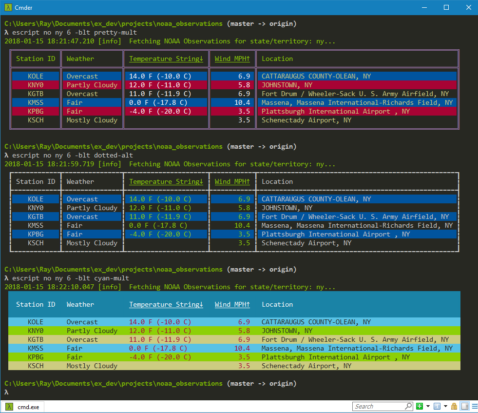

# NOAA Observations

Prints NOAA Observations to STDOUT in a table with borders and colors.

## Using

To use `NOAA Observations`, first clone it from GitHub:

  - git clone https://github.com/RaymondLoranger/noaa_observations

Then run these commands (in **Powershell** on Windows) to build the escript:

  - cd noaa_observations
  - chcp 65001 (on Windows)
  - mix deps.get
  - mix escript.build

Now you can run the application like so on Windows:

  - escript no --help (now in colors)
  - escript no ny 9 --last --table-style=dark

On macOS, you would run the application as follows:

  - ./no --help
  - ./no ny 9 --last --table-style=dark

N.B. The escript is named `no` for **n**oaa_**o**bservations.

## Examples
## 
