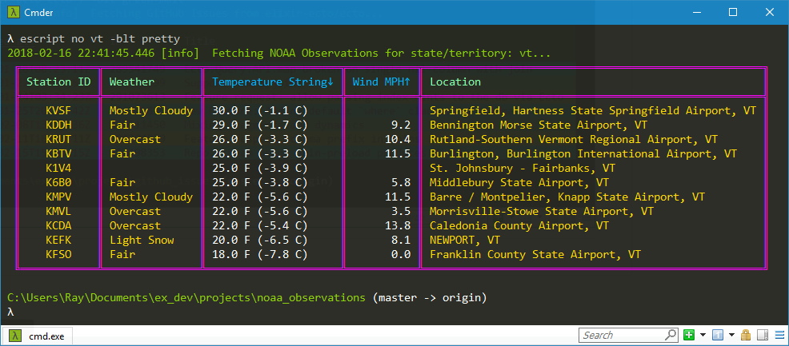
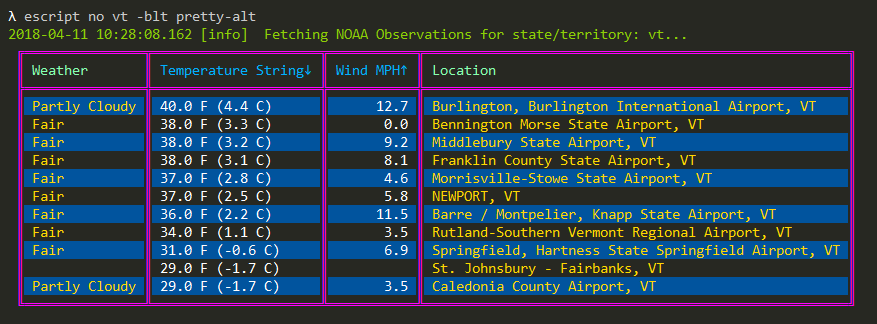
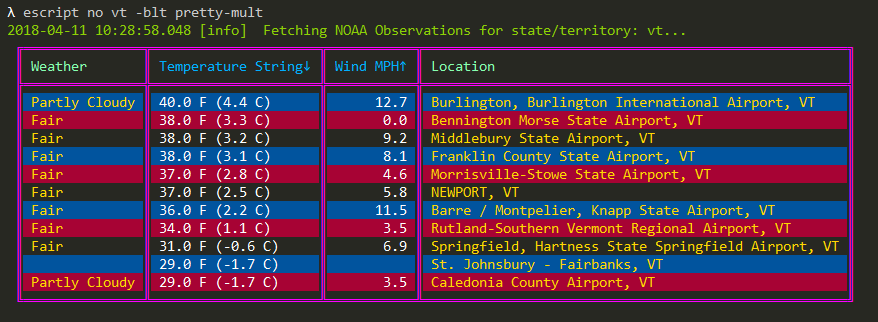
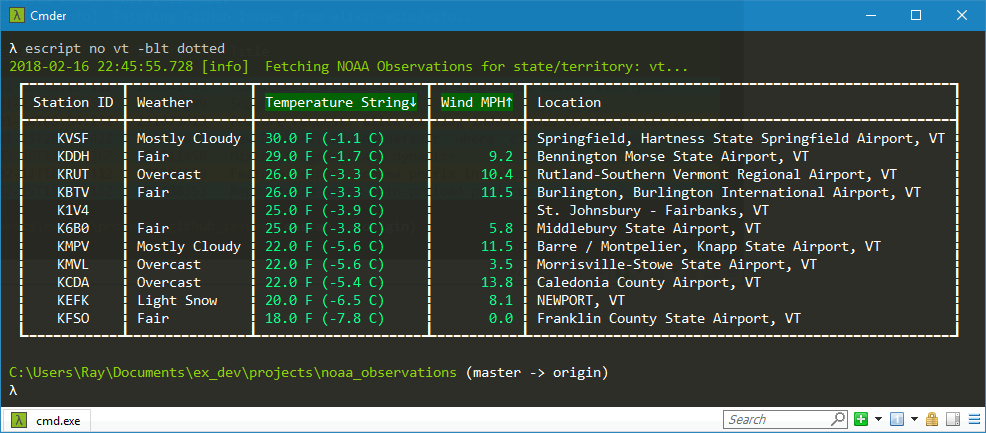
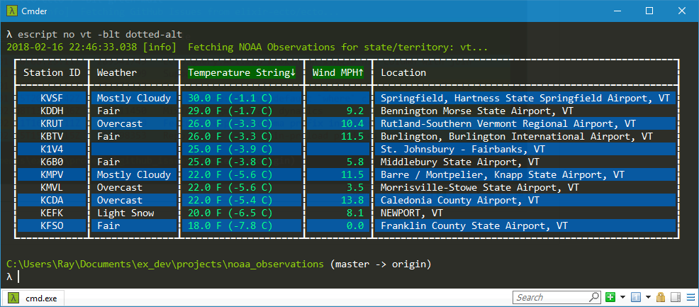
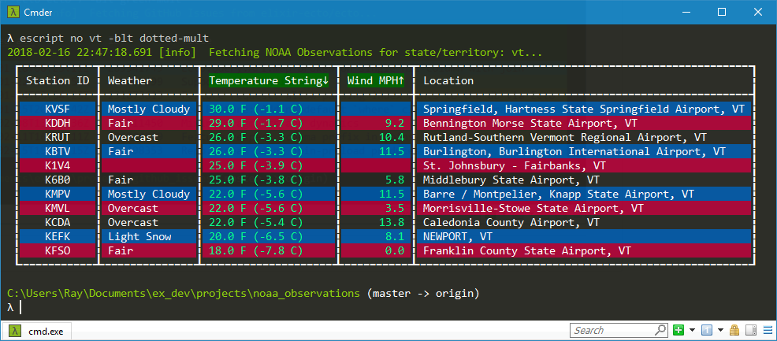

# NOAA Observations

Writes NOAA Observations to `:stdio` in a table with borders and colors.

##### Exercise in the book [Programming Elixir](https://pragprog.com/book/elixir16/programming-elixir-1-6) by Dave Thomas.

## Usage

To use `NOAA Observations` locally, run these commands:

  - `git clone https://github.com/RaymondLoranger/noaa_observations`
  - `cd noaa_observations`
  - `mix deps.get`
  - `mix escript.build`
  - `mix escript.install`

You can now run the application like so on Windows:

  - `no --help`
  - `no ny 9 -blt dark`
  - `no ny 9 --last --table-style=dark`

## Examples
## 
## 
## 
## 
## 
## 
